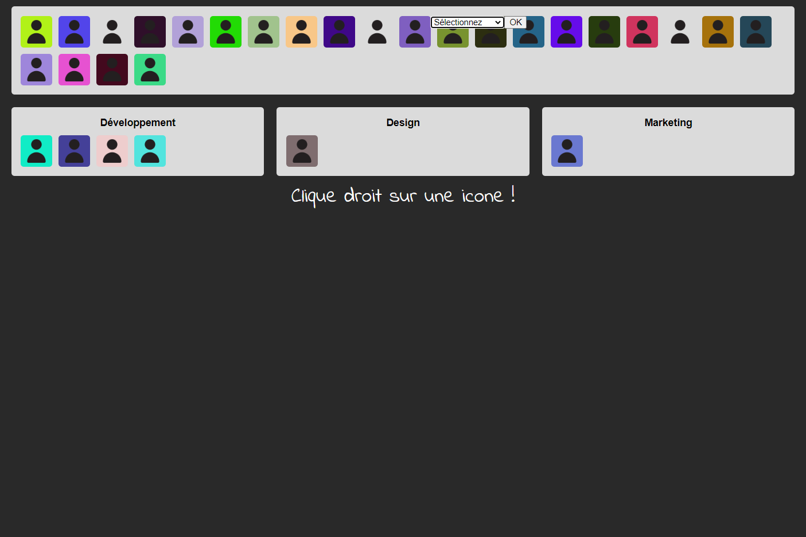

# DM Javascript

Clique [ici](http://mbaguelin.eemi.tech/HTML-CSS-JS/dm-js/) pour visualiser le projet.

L’objectif était de développer une page permettant d’associer des personnes avec une spécialité.

## Langages utilisés 

* HTML5 / CSS3
* Javascript

## Instructions

* Au clic droit sur un bonhomme, faire apparaître une liste déroulante permettant de sélectionner la spécialité choisie et un bouton de validation.
* Au clic sur le bouton de validation, déplacement du bonhomme dans la spécialité retenue.
* Les 30 bonhommes seront créés dynamiquement en JavaScript avec un background aléatoire.

## Aperçu

## Auteur(s) & date

* **Matis BAGUELIN**

*Mai 2020*
